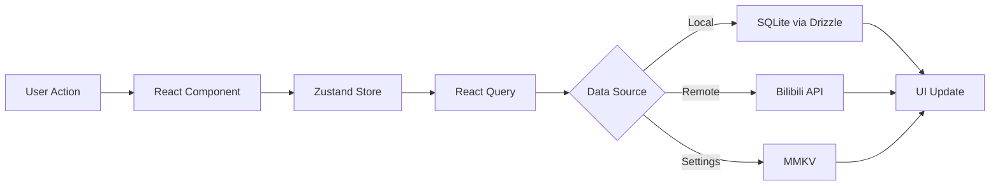

BBPlayer is a local-first Bilibili audio player built with React Native, designed to provide a lightweight and smooth music listening experience. The application follows a monorepo architecture with clear separation between mobile app, backend services, and shared packages.

## System Architecture

BBPlayer uses a **local-first architecture** where the mobile app operates independently with local data storage, while an optional backend service provides cloud synchronization and server-side features.

```
┌─────────────────────────────────────────────────────────────┐
│                      BBPlayer Ecosystem                     │
├─────────────────────────────────────────────────────────────┤
│                                                             │
│  ┌──────────────┐           ┌──────────────┐              │
│  │              │           │              │              │
│  │   Mobile     │◄─────────►│   Backend    │              │
│  │     App      │  Optional │   Service    │              │
│  │  (React      │  Sync     │  (Hono +     │              │
│  │   Native)    │           │  Cloudflare) │              │
│  │              │           │              │              │
│  └──────┬───────┘           └──────────────┘              │
│         │                                                  │
│         │                                                  │
│         ▼                                                  │
│  ┌──────────────┐                                         │
│  │   Shared     │                                         │
│  │  Packages    │                                         │
│  │              │                                         │
│  └──────────────┘                                         │
│                                                             │
└─────────────────────────────────────────────────────────────┘
```

## Core Components

### Mobile Application

The mobile app (`apps/mobile`) is the primary user-facing component built with:

- **React Native 0.83.1** with **React 19.2.0**
- **Expo 55** (preview) for development and build tooling
- **Expo Router** for file-based navigation
- **Local SQLite database** using Drizzle ORM for data persistence

<CardGroup cols={2}>
  <Card title="State Management" icon="database">
    **Zustand** for lightweight, performant state management across the app
  </Card>
  <Card title="Data Fetching" icon="arrow-right-arrow-left">
    **React Query (TanStack Query)** for server state management and caching
  </Card>
  <Card title="UI Framework" icon="palette">
    **React Native Paper** implementing Material Design 3 with Monet theming
  </Card>
  <Card title="Audio Playback" icon="music">
    **@bbplayer/orpheus** custom audio module based on Android Media3
  </Card>
</CardGroup>

### Backend Service

The backend (`apps/backend`) is a serverless API built with:

- **Hono** web framework
- **Cloudflare Workers** for deployment
- **PostgreSQL** with Drizzle ORM
- **ArkType** for runtime validation

<Info>
The backend service is optional. The mobile app is designed to work fully offline with local data storage.
</Info>

### Shared Packages

The monorepo includes several shared packages that encapsulate reusable functionality:

<CardGroup cols={2}>
  <Card title="@bbplayer/orpheus" icon="circle-play">
    Audio playback module built on Expo modules and Android Media3 ExoPlayer
  </Card>
  <Card title="@bbplayer/splash" icon="file-lines">
    Lyrics parsing and conversion library supporting SPL format with word-level timing
  </Card>
  <Card title="@bbplayer/image-theme-colors" icon="droplet">
    Extract theme colors from images using Expo ImageRef for Material You theming
  </Card>
  <Card title="@bbplayer/logs" icon="terminal">
    Performance-aware logger with namespaces and custom transports
  </Card>
</CardGroup>

## Data Flow

### Local-First Data Model

BBPlayer prioritizes local data storage and offline functionality:

1. **Local SQLite Database**: Stores playlists, downloads, play history, and metadata
2. **MMKV Storage**: Fast key-value storage for app settings and cache
3. **File System**: Audio files, lyrics, and exported media



### Feature Architecture

The mobile app organizes features by domain:

- **Player**: Audio playback, queue management, lyrics display, danmaku
- **Library**: Playlists, collections, favorites from Bilibili account
- **Downloads**: Offline caching and export to M4A with metadata
- **Home**: Search, quick access, recommendations
- **Leaderboard**: Play history statistics and rankings

<Note>
Each feature is self-contained with its own components, hooks, and business logic, following a feature-sliced architecture pattern.
</Note>

## Technology Philosophy

### Performance-First

- **React Compiler**: Uses React 19's compiler for automatic optimization
- **Native Modules**: Custom Expo modules for performance-critical operations
- **Efficient List Rendering**: Shopify FlashList for smooth scrolling
- **Reanimated 4.2**: Smooth animations running on UI thread

### Developer Experience

- **TypeScript 5.9**: Full type safety across the monorepo
- **Monorepo with pnpm**: Efficient package management with workspaces
- **Modern Tooling**: Oxlint, Oxfmt for fast linting and formatting
- **Git Hooks**: Lefthook for automated quality checks

### Platform Integration

- **Material Design 3**: Native Android design language
- **Edge-to-Edge**: Full-screen immersive experience
- **Monet Theming**: Dynamic color extraction from album art
- **Native Gestures**: React Native Gesture Handler for smooth interactions

## Next Steps

<CardGroup cols={2}>
  <Card title="Monorepo Structure" icon="folder-tree" href="/architecture/monorepo">
    Learn about the workspace organization and package relationships
  </Card>
  <Card title="Tech Stack Details" icon="layer-group" href="/architecture/tech-stack">
    Deep dive into the technologies powering BBPlayer
  </Card>
</CardGroup>